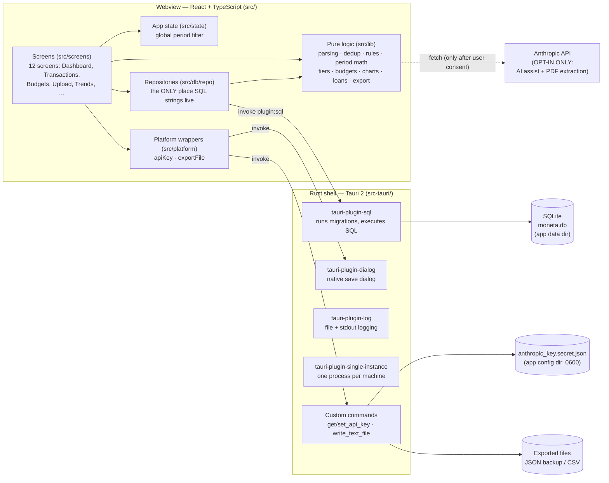
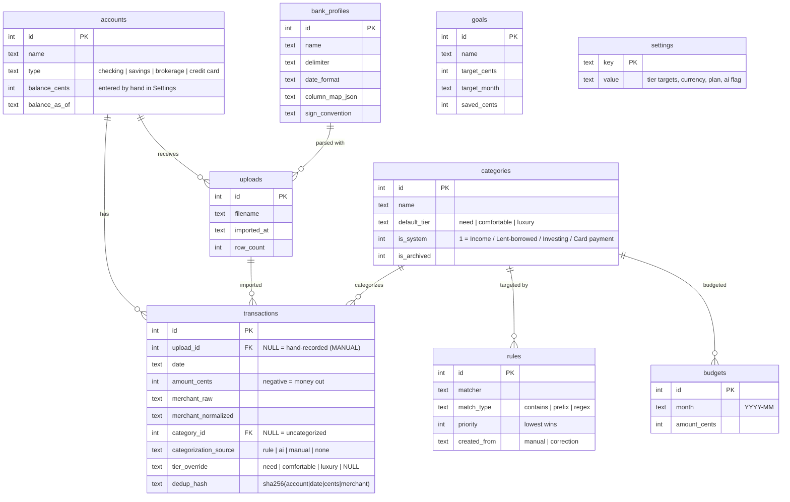
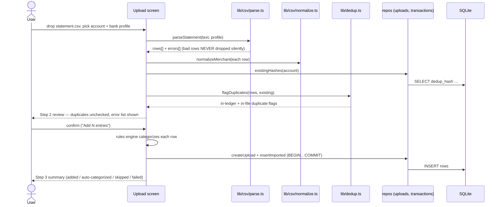
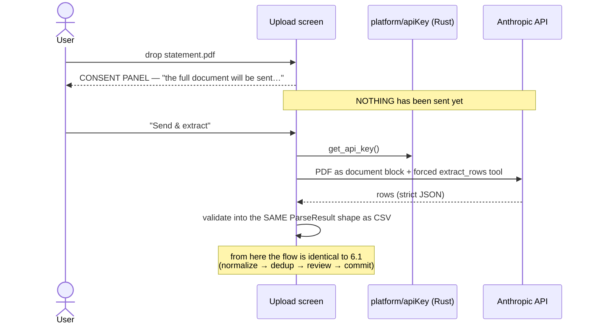
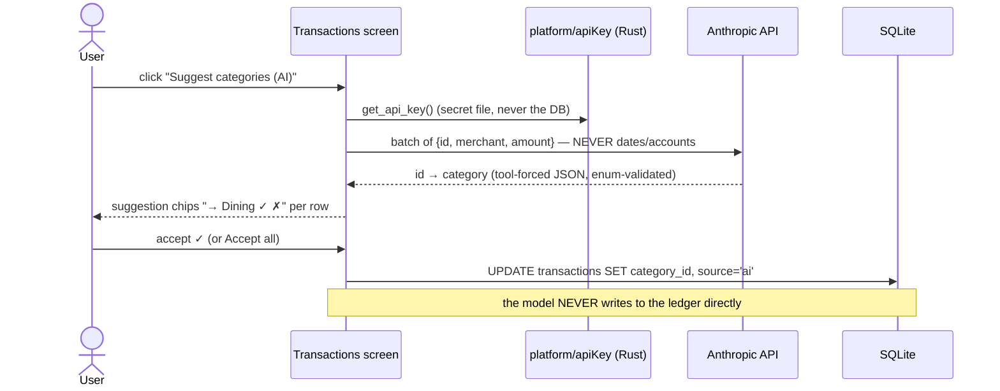
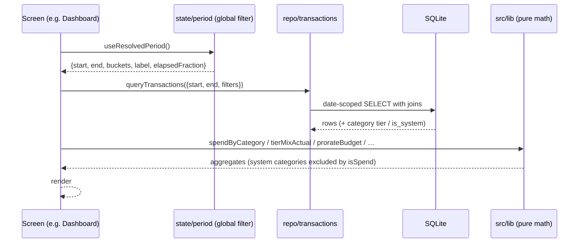
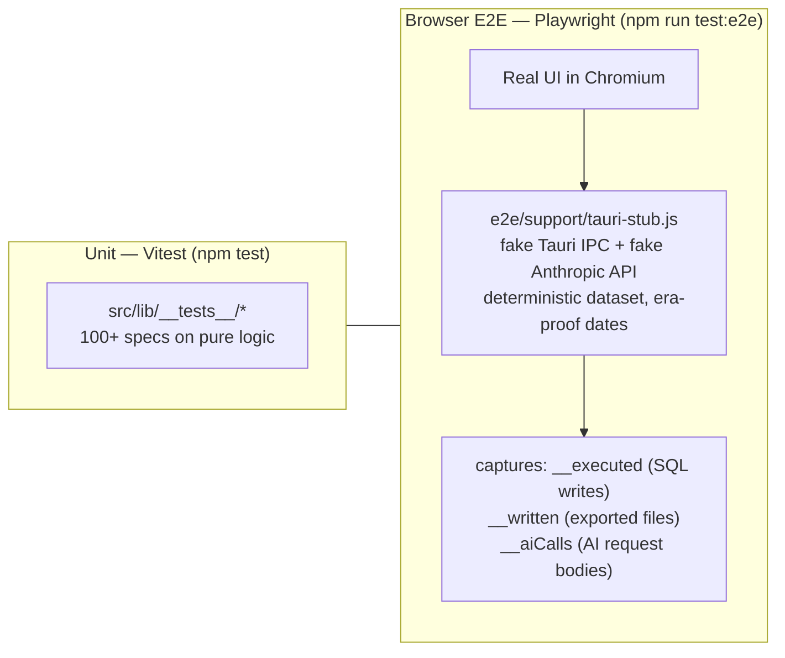

# Moneta — Architecture

This document explains how Moneta is put together, from the 30-second
overview down to sequence diagrams of the important flows. It is written so
that an engineer who has never seen the codebase can find their way around.
All diagrams are [Mermaid](https://mermaid.js.org/) and render directly on
GitHub.

> **Keep this document current.** Whenever a feature or flow changes, the
> matching diagram and section here must be updated in the same change
> (see the Documentation discipline in `CLAUDE.md`).

---

## 1. The 30-second mental model

Moneta is a **local-first desktop bookkeeping app**. Think of it as three
boxes:

1. **A React app** (TypeScript, in `src/`) that renders 12 screens and holds
   all business logic in pure, unit-tested modules.
2. **A thin Rust shell** (Tauri 2, in `src-tauri/`) that gives the React app
   a native window, an SQLite database, a native save dialog, and a secret
   file for the API key.
3. **SQLite** — the single system of record. One file on the user's disk.
   No server, no cloud, no telemetry.

The only thing that ever leaves the machine is the **explicitly opt-in** AI
assist (merchant + amount only) and **per-file-consented** PDF extraction.

## 2. High-level block diagram



## 3. Directory map

| Path | What lives there | Rule |
| --- | --- | --- |
| `src/screens/` | One React component per screen | No SQL, no business math — compose lib + repos |
| `src/state/` | Global period filter (React context) | Selection only; math lives in `src/lib/period.ts` |
| `src/lib/` | Pure TypeScript business logic | No Tauri, DOM, or React imports. Every module has Vitest specs |
| `src/db/client.ts` | The single SQLite connection | — |
| `src/db/repo/` | One repository per table group | The only place SQL strings are written |
| `src/db/backup.ts` | Full-dump gather + danger-zone wipe | — |
| `src/platform/` | Typed wrappers over Rust commands | — |
| `src/components/` | Shared UI (chart primitives, stubs) | — |
| `src-tauri/migrations/` | Numbered `.sql` files | Append-only; never edit a shipped migration |
| `src-tauri/src/lib.rs` | Plugin registration + custom commands | Kept intentionally tiny |
| `e2e/` | Playwright browser tests + Tauri IPC stub | See §8 |
| `design-reference/` | The Claude Design HTML — source of truth for visuals | — |

## 4. Data model

Money is always **integer cents**; dates are ISO-8601 strings; enums are
`TEXT` + `CHECK` constraints.



Two concepts a newcomer must know:

- **System categories** (`is_system = 1`: Income, Lent & borrowed, Investing
  transfer, Card payment) route money that is *not spending*. Every
  spend/tier aggregation excludes them via one helper — `isSpend()` in
  `src/lib/budget.ts`. A card payment can never inflate a budget.
- **Effective tier** = `tier_override ?? category.default_tier`
  (`src/lib/tier.ts`). Uncategorized rows have *no* tier; aggregations
  exclude them but always surface their count so the mix is never silently
  wrong.

## 5. How a transaction gets its category and tier (flow diagram)

```mermaid
flowchart TD
    A[Row committed from Upload review] --> B{Rules engine\nsrc/lib/rules.ts\npriority order, first match wins}
    B -- match --> C["category_id set\nsource = 'rule'"]
    B -- no match --> D["uncategorized\nsource = 'none'"]
    D --> R2{User clicks 'Apply rules'?\n(re-runs the engine over\nexisting uncategorized rows)}
    R2 -- match --> C
    R2 -- no match --> E
    D --> E{AI assist enabled\nAND user clicks\n'Suggest categories'?}
    E -- yes --> F["Anthropic batch call\n(merchant + amount ONLY)"]
    F --> G{User accepts\nsuggestion chip ✓?}
    G -- yes --> H["category_id set\nsource = 'ai'"]
    G -- no --> D
    E -- no --> I[User recategorizes by hand]
    I --> J["source = 'manual'\n+ offer: create a rule from\nthis correction"]
    C & H & J --> K{Effective tier}
    K --> L["tier_override if set,\nelse category default_tier"]
    L --> M[Budgets · tier mix · charts]
```

## 6. Sequence diagrams for the important flows

### 6.1 CSV import (Upload screen, steps 1→2→3)



### 6.2 PDF import — per-file consent



### 6.3 AI categorization assist (opt-in)



### 6.4 Reading data — how every screen gets its numbers



### 6.5 Backup, export, wipe (Settings)

```mermaid
sequenceDiagram
    actor U as User
    participant SET as Settings screen
    participant B as db/backup.ts
    participant E as lib/export.ts
    participant D as tauri-plugin-dialog
    participant W as write_text_file (Rust)

    U->>SET: "Export JSON backup"
    SET->>B: gatherBackupData() (full table dump)
    SET->>E: buildBackup(...) — versioned JSON, key CANNOT be included
    SET->>D: native save dialog
    SET->>W: write bytes to the chosen path
    Note over SET,E: optional password → AES-256-GCM envelope<br/>(PBKDF2 600k iterations; lib/crypto.ts)
    U->>SET: "Restore from backup…" → pick file
    SET->>E: encrypted? ask password + decryptText first
    SET->>E: parseBackup(contents) — validates BEFORE any write
    SET-->>U: preview (date + row counts) + replace-everything confirm
    U->>SET: confirm
    SET->>B: restoreBackup() — full teardown, parents-first reinsert,<br/>original ids preserved
    U->>SET: "Wipe all data…" → type WIPE
    SET->>B: wipeAllData() — children-first DELETEs,<br/>categories & settings survive
```

### 6.6 Correcting mistakes — delete, undo import

Every destructive action is two-click (arm, then confirm) and nothing is
deleted before the second click:

- **Delete a transaction** — the × at the end of each ledger row, or select
  rows and use the bulk `Delete N… → Really delete N?` button
  (`deleteTransactions` in `repo/transactions.ts`).
- **Undo a whole import** — Settings → IMPORT HISTORY lists every upload
  with how many of its entries are still in the ledger; "undo import"
  deletes exactly those transactions, then the upload record
  (`deleteUpload` in `repo/uploads.ts`, children first).

### 6.7 Display currency

`formatCents` renders in the currency chosen in Settings
(`setDisplayCurrency` in `src/lib/money.ts`). It is loaded before the first
render and applied immediately on change — display only; stored amounts are
plain integer cents with no currency attached.

## 7. The period filter — one filter to rule every screen

The period bar (WEEK / MONTH / YEAR / CUSTOM with ◀ ▶) is global state.
`src/lib/period.ts` resolves the selection into `{start, end, buckets}`:

- week/month → daily buckets; year → monthly; custom → auto by length
- budgets are **monthly**; other scopes compare against a prorated amount:
  `Σ budget(month) × overlapDays / daysInMonth` (`prorateBudget`)
- `elapsedFraction` drives the "pace" tick on progress bars

Every read query is scoped to `[start, end]`, so switching the period
changes every screen at once.

## 8. Testing architecture



The E2E stub means the *entire* React app runs its real code paths — only
the Rust boundary is faked. Tests assert on rendered UI **and** on captured
side effects, including the privacy guarantees (AI requests contain no
dates/accounts; exports never contain the API key; PDF sends nothing before
consent).

## 9. Build & release

Local:

```
npm run tauri dev      # run the app (hot reload)
npm run tauri build    # package for THIS machine → src-tauri/target/release/bundle/
```

CI (`.github/workflows/build.yml`):

- **test job** — every push/PR: typecheck, Vitest, Playwright E2E.
- **build job** — on version tags (`git tag v0.1.0 && git push --tags`) or
  manual dispatch: packages macOS Apple Silicon
  (`aarch64-apple-darwin`), macOS Intel (`x86_64-apple-darwin`), and
  Windows (`x86_64-pc-windows-msvc`), attaching bundles to a draft GitHub
  release.

The app icon is generated from a single `app-icon.png` (1024×1024) at the
repo root via `npx tauri icon app-icon.png`, which writes every platform
size into `src-tauri/icons/`.

## 10. Logs & troubleshooting

Where the logs are:

| Context | Location |
| --- | --- |
| Packaged app, macOS | `~/Library/Logs/com.moneta.app/moneta.log` |
| Packaged app, Windows | `%LOCALAPPDATA%\com.moneta.app\logs\moneta.log` |
| `npm run tauri dev` | same file, plus the terminal (stdout) and the webview devtools console |

What gets logged:

- **Every failed SQL statement** — `src/db/client.ts` wraps the single
  shared connection's `select`/`execute`, so any database error is written
  with the failing query text before it reaches the UI. This is the first
  place to look for errors like `database is locked`.
- Uncaught window errors and unhandled promise rejections (`src/main.tsx`).
- Rust-side plugin/log output. Log files rotate at ~2 MB.

Every error a user can meet — SQLite codes, Anthropic API statuses, parse
errors — is cataloged with causes and fixes in
[`docs/ERROR-CODES.md`](./ERROR-CODES.md).

Known pitfall — **"database is locked" (SQLite code 5)**:

1. The SQL plugin executes statements on a connection *pool*. Manual
   `BEGIN`/`COMMIT` statements are therefore forbidden in this codebase —
   they can run on *different* pooled connections and leave a stray open
   write-transaction holding the file lock. Multi-row work uses single
   atomic `INSERT … VALUES (…), (…), …` statements instead, and dedup
   hashes make any retry safe.
2. Two app processes sharing one database file cause the same error —
   `tauri-plugin-single-instance` now focuses the existing window instead
   of launching a second process.
